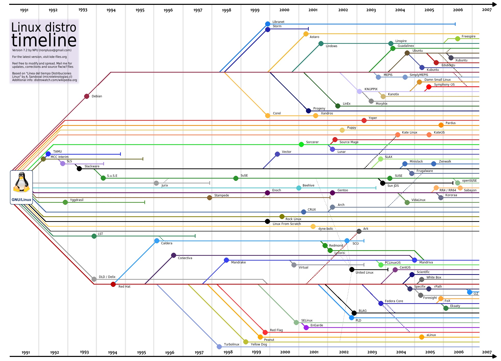

# Qué es Linux

## Orígen
- **1969:** AT&T Bell Laboratories libera la primera versión del sistema operativo [Unix](https://es.wikipedia.org/wiki/Unix).
- **1970:** La Universidad de California comienza a desarrollar el [Berkeley Software Distribution - BSD](https://es.wikipedia.org/wiki/Berkeley_Software_Distribution) a partir del código fuente de Unix
- **1978:** AT&T retira el permiso a la Universidad de California, generando la necesidad de promover la creación de un nuevo sistema operativo a partir de los aportes que ya habían realizado.
- **1983:** [Richard Stallman]() crea el [GNU Project](https://es.wikipedia.org/wiki/Proyecto_GNU) el cual es un proyecto que impulsa la colaboración en masa del software libre y libera GNU como sistema operativo.
- **1991:** [Linus Torvald](), desarrolla **Linux**, un proyecto el cual consistía en crear un núcleo (Kernel) de un sistema operativo libre.
- **1992:** Se libera la primera versión del sistema operativo Linux como un completo conjunto de software libre.
- **1992:** Se incluye el sistema [X Window]() a Linux, permitiendo tener una interfaz gráfica de usuario.
- **Siguientes años:** Comenzaría la explosión de sistemas operativos

## GNU

Creado por Richard Stallman. Su nombre es un acrónimo de GNU is Not Unix, haciendo enfásis a la libertad sobre el software. GNU es una colección de programas, juegos, aplicaciones, bibliotecas, herramientas de desarrollo y hasta juegos.

# Linux

Linux es el kernel que permite la comunicación entre el Hardware y el Software en un dispositivo. Sin embargo con el paso de los años las personas se refieren a Linux como el sistema operativo.

