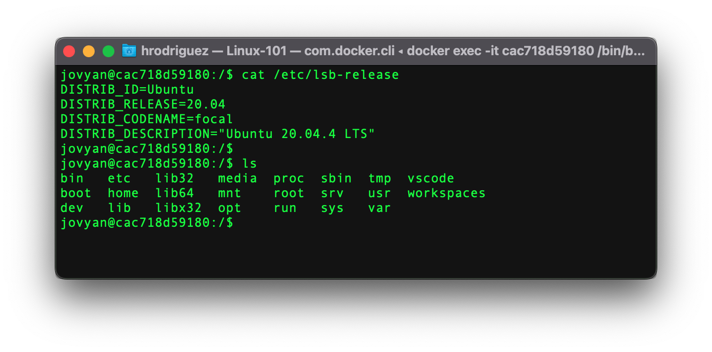

# Terminal

La mayoría de sistemas operativos hoy en día cuentan con una interfaz gráfica que permite relaizar acciones a través de click y doble clicks, que posteriomente el sistema operativo los interpreta y los convierte en comandos. Sin embargo antes de que los computadores contaran con este sistema gráfico, era necesario escribir los comandos a través de una terminal. Cada vez que se digitaba un comando, este ejecutaba otros programas, algunas veces imprimian en pantalla la salida, y al final muestra un aviso indicando que se encuentra listo para el siguiente comando.

¿Cuál es la relación entre un explorador de archivos y la línea de comandos o terminal?
- **A:** El explorador de archivos permite ver y editar arhcivos, mientras que la terminal permite correr programas.
- **B:** El explorar de archivos está construido encima de la terminal
- **C:** La termianl es parte del sistema operativo, mientras que el explorador de archivos no.
- **D:** Ambas interfaces permiten enviar comandos al sistema operativo

## Comandos

|Comando| Descripción | Sintaxis |
|---------|-------------|----------|
|`sudo`| Se utiliza para ejecutar con permisos de admin | sudo command |
|`awk`|Se utiliza para buscar patrones de cadena|awk ‘{ print $1}’
|`adduser`|Se utiliza para añadir un usuario.|adduser usuario
|`passwd`|Se utiliza para establecer la contraseña a un usuario.|passwd usuario
|`cat`|Muestra el contenido del archivo en pantalla en forma continua.|cat archivo
|`cd`|Cambia de directorio.|cd nom_directorio.
|`chmod`|Cambia los permisos de un archivo.|chmod permisos archivo
|`chown`|Cambia el dueño un archivo.|chown propietario:grupo archivo
|`clear`|Limpia la pantalla.|clear
|`exit`|Cierra las ventanas o las conexiones remotas establecidas.|exit
|`head`|Muestra las primeras líneas de un fichero.|head -count archivo
|`ls`|Lista los archivos y directorios dentro del directorio de trabajo.|ls
|`ll`|Realiza lo mismo que ls pero con mas detalle|ll
|`mkdir`|Crea un nuevo directorio.|mkdir directorio
|`pwd`|Muestra el directorio actual de trabajo.|pwd.
|`cp`|Copia archivos.|cp archivo nuevoarchivo
|`du`|Muestra el tamaño del directorio o archivo.|du -h archivo
|`file`|Muestra que tipo de archivo.|file archivo
|`grep`|Busca patrones de texto en archivos.|grep *seg* directorio
|`head`|Muestra el inicio de un archivo.
|`mv`|sirve para mover o renombrar un archivo|mv archivo1 archivo2
|`more`|Visualiza página a página un archivo.|more archivo
|`tail`|Muestra el final de un archivo|tail archivo
|`cal`|muestra el calendario|cal
|`date`|Muestra la hora y la fecha|date
|`echo`|imprime en consola|echo "prueba"
|`id`|Número id de un usuario|id
|`kill`|Matar un proceso.|kill idprocess
|`man`|Ayuda del comando especificado.|man comando
